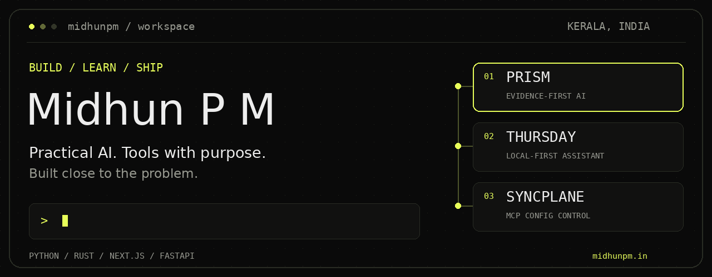

<a href="https://midhunpm.in">
  <picture>
    <source media="(prefers-reduced-motion: reduce)" srcset="assets/profile-hero.png">
    
  </picture>
</a>

# Hey, I'm Midhun P M.

I build **AI systems, developer tools, and web products** — from a Linux assistant that runs local models to a Rust CLI that keeps AI clients in sync. I care about visible tool calls, useful failures, and software that holds up after the demo.

Third-year CSE student at **Sahrdaya College of Engineering and Technology** · Kerala, India 
**IEEE Technical Coordinator** · Class of 2028 · CGPA **9.70**

**[Portfolio ↗](https://midhunpm.in)** &nbsp; / &nbsp; **[LinkedIn ↗](https://www.linkedin.com/in/midhun-pm-b947a1279/)** &nbsp; / &nbsp; **[Email ↗](mailto:midhun.titan@gmail.com)**

Open to internships in **backend engineering, AI systems, and performance-sensitive software**.

---

### 01 / Selected builds

#### [PRISM](https://github.com/9MidhunPM/prism) — AI that shows its work

An evidence-first workspace for reviewing handwritten exam papers. Connects answers to rubrics, surfaces uncertainty, and keeps the teacher in control of the final assessment.

`Next.js` `FastAPI` `OpenAI` `SQLite` `Docker` 
**2nd place · AI Innovation Hackathon 2026, ASIET** 
[Source ↗](https://github.com/9MidhunPM/prism) · [The build story ↗](https://midhunpm.in/projects/prism)

#### [Thursday](https://github.com/9MidhunPM/thursday-local-assistant) — an assistant at home on Linux

A local-first desktop assistant with visible tool calls, persistent memory, voice, and a Codex project studio. Runs with local models through llama.cpp/Vulkan or an OpenAI-compatible cloud provider.

`Python` `React` `llama.cpp` `Vulkan` `SQLite` `Codex CLI` 
[Source ↗](https://github.com/9MidhunPM/thursday-local-assistant) · [The build story ↗](https://midhunpm.in/projects/thursday)

#### [Syncplane](https://github.com/9MidhunPM/syncplane) — one MCP config, five AI clients

A local-first Rust CLI that projects one canonical MCP configuration into supported AI clients, with reviewable plans, explicit ownership, and OS-keyring-backed secrets.

`Rust` `MCP` `TOML` `JSONC` `OS Keyring` 
[Source ↗](https://github.com/9MidhunPM/syncplane) · [Website ↗](https://syncplane.midhunpm.in) · [The build story ↗](https://midhunpm.in/projects/syncplane)

**Also built** 
[MetroMind](https://midhunpm.in/projects/metromind) — a WhatsApp AI agent for Kochi Metro commutes. 
[ETLab+](https://midhunpm.in/projects/etlab-plus) — a mobile student companion for the college ERP. 
[WC Predict ’26](https://midhunpm.in/projects/wc-predict-26) — IEEE Sahrdaya's World Cup prediction platform.

### 02 / Out of the terminal

- **2nd place, ASIET AI Innovation Hackathon** — built PRISM in 24 hours. [Build note ↗](https://midhunpm.in/blog/building-prism-at-adi-shankara-ai-innovation-hackathon)
- **Selected, OpenAI Codex Community Hackathon · Bengaluru** — brought Thursday to the August 2026 event. [Build note ↗](https://midhunpm.in/blog/taking-thursday-to-openai-codex-community-hackathon-bengaluru)
- **Top 10, OpenAI Codex Nightline · Kochi** — built MetroMind at the July 2026 metro sprint. [Project ↗](https://midhunpm.in/projects/metromind)

### 03 / My workbench

**Languages** &nbsp; Python · Rust · TypeScript · C / C++ 
**Products** &nbsp; React · Next.js · FastAPI · React Native · Spring Boot 
**AI & tools** &nbsp; LangGraph · LangChain · llama.cpp · Playwright · MCP 
**Infrastructure** &nbsp; Linux · Docker · Dokploy · AWS · Tailscale

Off the main branch: running models on an **Intel Arc GPU**, self-hosting on an **Ubuntu home server**, and writing **C++ without a game engine**.

---

**Have something worth building? [Let's talk. ↗](mailto:midhun.titan@gmail.com)** 
More projects, writing, and the reasoning behind the code → **[midhunpm.in](https://midhunpm.in)**

[Static banner](assets/profile-hero.png) · Profile facts refreshed September 2026.
