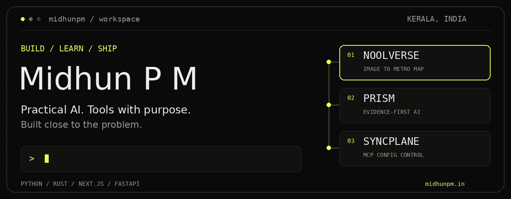

<a href="https://midhunpm.in">
  <picture>
    <source media="(prefers-reduced-motion: reduce)" srcset="assets/profile-hero.png">
    
  </picture>
</a>

# Hey, I'm Midhun P M.

I build **AI systems, developer tools, and web products** — from a Linux desktop copilot to a Rust CLI that keeps AI clients in sync. I care about visible tool calls, useful failure states, and software that holds up after the demo.

Third-year CSE student at **Sahrdaya College of Engineering and Technology** · Kerala, India 
**IEEE Technical Coordinator** · Class of 2028 · CGPA **9.70**

**[Portfolio ↗](https://midhunpm.in)** &nbsp; / &nbsp; **[LinkedIn ↗](https://www.linkedin.com/in/midhun-pm-b947a1279/)** &nbsp; / &nbsp; **[Email ↗](mailto:midhun.titan@gmail.com)**

Open to internships in **backend engineering, AI systems, and performance-sensitive software**.

---

### 01 / Selected builds

#### [NightWatch](https://github.com/9MidhunPM/NightWatch) — infrastructure operations you can inspect

An agentic infrastructure operations console with a live 3D/2D view of Dokploy, Docker, Beszel, and route evidence. Typed tools prepare versioned changes for approval, then preserve execution and verification evidence.

`Next.js` `FastAPI` `Three.js` `SQLite` `OpenAI` `Dokploy` 
[Source ↗](https://github.com/9MidhunPM/NightWatch) · [Narrated demo ↗](https://drive.google.com/file/d/1TDCbsb495BiY4YK6dNxIdD-WkLR4p85g/view?usp=sharing) · [The build story ↗](https://midhunpm.in/projects/nightwatch)

#### [Noolu Pidichaal Mathi](https://github.com/9MidhunPM/NooluPidichaalMathii) — a metro map hiding in an idiyappam

I turned an idiyappam photograph into NoolVerse: a fictional, routeable metro system with image processing, shortest-path routing, and a 3D explorer.

`Next.js` `FastAPI` `OpenCV` `PostgreSQL` `Three.js` `Docker` 
[Source ↗](https://github.com/9MidhunPM/NooluPidichaalMathii) · [Try NoolVerse ↗](https://idiyappam.midhunpm.in) · [The build story ↗](https://midhunpm.in/projects/noolu-pidichaal-mathi)

#### [PRISM](https://github.com/9MidhunPM/prism) — AI that shows its work

An evidence-first workspace for reviewing handwritten exam papers. Connects answers to rubrics, surfaces uncertainty, and keeps the teacher in control of the final assessment.

`Next.js` `FastAPI` `OpenAI` `SQLite` `Docker` 
**2nd place · AI Innovation Hackathon 2026, ASIET** 
[Source ↗](https://github.com/9MidhunPM/prism) · [The build story ↗](https://midhunpm.in/projects/prism)

#### [Thursday](https://github.com/9MidhunPM/thursday-local-assistant) — an assistant at home on Linux

A Linux desktop copilot with visible tools, task checkpoints, memory review, voice, and a Codex project studio. The desktop default uses GPT-6 Luna through the Responses API; local llama.cpp and compatible providers remain configurable.

`Python` `OpenAI` `Hypruse` `React` `SQLite` `llama.cpp` `Codex CLI` 
[Source ↗](https://github.com/9MidhunPM/thursday-local-assistant) · [The build story ↗](https://midhunpm.in/projects/thursday)

#### [Syncplane](https://github.com/9MidhunPM/syncplane) — one MCP config, five AI clients

A local-first Rust CLI that projects one canonical MCP configuration into supported AI clients, with reviewable plans, explicit ownership, and OS-keyring-backed secrets.

`Rust` `MCP` `TOML` `JSONC` `OS Keyring` 
[Source ↗](https://github.com/9MidhunPM/syncplane) · [Website ↗](https://syncplane.midhunpm.in) · [The build story ↗](https://midhunpm.in/projects/mcpd)

**Also built** 
[MetroMind](https://midhunpm.in/projects/metromind) — a WhatsApp AI agent for Kochi Metro commutes. 
[ETLab+](https://midhunpm.in/projects/etlab-plus) — a mobile student companion for the college ERP. 
[WC Predict ’26](https://midhunpm.in/projects/wc-predict-26) — IEEE Sahrdaya's World Cup prediction platform.

### 02 / Out of the terminal

- **🥈 Second Prize, Codex Community Hackathon · Calicut** — built NightWatch. Prize: **3 months of ChatGPT Pro + $500 OpenAI API credits**. [Build note ↗](https://midhunpm.in/blog/building-nightwatch-at-codex-community-hackathon-calicut)
- **2nd place, ASIET AI Innovation Hackathon** — built PRISM in 24 hours. [Build note ↗](https://midhunpm.in/blog/building-prism-at-adi-shankara-ai-innovation-hackathon)
- **Selected, OpenAI Codex Community Hackathon · Bengaluru** — brought Thursday to the August 2026 event. [Build note ↗](https://midhunpm.in/blog/taking-thursday-to-openai-codex-community-hackathon-bengaluru)
- **Top 10, OpenAI Codex Nightline · Kochi** — built MetroMind at the July 2026 metro sprint. [Project ↗](https://midhunpm.in/projects/metromind)

### 03 / My workbench

**Languages** &nbsp; Python · Rust · TypeScript · C / C++ 
**Products** &nbsp; React · Next.js · FastAPI · React Native · Spring Boot 
**AI & tools** &nbsp; LangGraph · LangChain · llama.cpp · Playwright · MCP 
**Infrastructure** &nbsp; Linux · Docker · Dokploy · AWS · Tailscale

Off the main branch: running models on an **Intel Arc GPU**, self-hosting on an **Ubuntu home server**, and writing **C++ without a game engine**.

### 04 / Notes from the workbench

- [Building NightWatch at Codex Community Hackathon, Calicut ↗](https://midhunpm.in/blog/building-nightwatch-at-codex-community-hackathon-calicut) — the infrastructure agent and its approval loop.
- [Running local LLMs on an Intel Arc GPU with Vulkan and llama.cpp ↗](https://midhunpm.in/blog/running-llms-on-intel-arc-vulkan) — what works when the GPU is not NVIDIA.
- [Building PRISM in 24 hours at ASIET ↗](https://midhunpm.in/blog/building-prism-at-adi-shankara-ai-innovation-hackathon) — the guardrails behind an evidence-first review tool.
- [Building an adaptive interview system at VicoDathon ↗](https://midhunpm.in/blog/building-probe-interview-at-vicodathon) — why I used a graph instead of one supervisor prompt.

---

**Have something worth building? [Let's talk. ↗](mailto:midhun.titan@gmail.com)** 
More projects, writing, and the reasoning behind the code → **[midhunpm.in](https://midhunpm.in)**

[Static banner](assets/profile-hero.png) · Profile facts refreshed October 2026.
